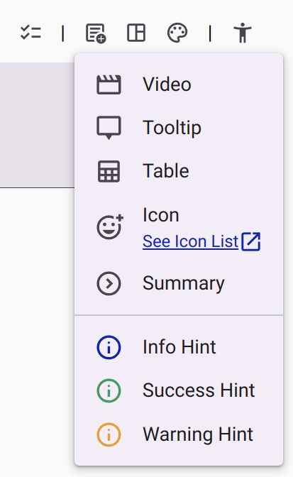

# Info Boxes

Info boxes are colored callouts that set a block of content apart — a note, a confirmation, a caution, or an error. They are written with the `:::` **block directive**: a keyword on the opening line gives the box its meaning, and a closing `:::` ends it.

The Rich Text Editor inserts them from the **Add Content** menu (**Info Hint**, **Success Hint**, and **Warning Hint**), but you can also type them directly. This is useful when importing Markdown content or when editing several boxes at once.

<figure>
  
  <figcaption>The Info, Success and Warning Hint items in the Add Content menu.</figcaption>
</figure>

## Syntax

The keyword follows the opening `:::`, on the same line. The closing `:::` sits on its own line.

```markdown
::: info
This is an info box.
:::
```

## Available Box Types

Each type has its own accent color. All types adapt to the active theme (light, dark, and contrast themes).

| Keyword | Meaning | Toolbar menu item |
| :--- | :--- | :--- |
| `info` | Neutral information or a note. | Info Hint |
| `success` | A positive confirmation. | Success Hint |
| `warning` | A caution or a non-critical issue. | Warning Hint |
| `error` | A critical error or invalid content. | — (type it manually) |
| `danger` | Synonym of `error`. | — (type it manually) |

## Content Inside a Box

The content inside a box is regular Markdown: headings, lists, links, bold and italic text, and images all render normally.

```markdown
::: success
### Your response was saved

You can safely close this page — your answers were submitted.
:::
```

## Deprecated: `<gitbook-hint>` Widgets

Content created with earlier versions of the editor may contain `<gitbook-hint>` tags, for instance `<gitbook-hint type="info">…</gitbook-hint>`. The widget is deprecated and the editor no longer inserts it. The editor preview still renders it, but deployed surveys treat it as an unknown element, so the box styling is lost there. Replace it with the `:::` directive.

| Deprecated tag | Replacement |
| :--- | :--- |
| `<gitbook-hint type="info">…</gitbook-hint>` | `::: info` … `:::` |
| `<gitbook-hint type="success">…</gitbook-hint>` | `::: success` … `:::` |
| `<gitbook-hint type="warning">…</gitbook-hint>` | `::: warning` … `:::` |
| `<gitbook-hint type="danger">…</gitbook-hint>` | `::: error` … `:::` |

## Customizing a Box (Advanced)

The boxes are styled with [CSS tokens](./css-tokens.md) and follow the active theme by default. When you need a different accent, background, spacing, or corner radius, override the `--md-hint-*` tokens with an [HTML container](./visibility-control.md#method-3-html-containers) or an inline style:

```html
<div class="info" style="--md-hint-background: var(--color-primary-container)">
  This info box uses the primary container color as its background.
</div>
```

| Token | Default | Description |
| :--- | :--- | :--- |
| `--md-hint-color` | Color of the box type | Accent bar color. |
| `--md-hint-background` | `--color-surface-container-high` | Box background color. |
| `--md-hint-padding` | `--space-medium` | Inner padding of the box. |
| `--md-hint-radius` | `6px` | Corner radius of the accent side. |
| `--md-hint-color-info` | `--color-primary` | Accent color of `info` boxes. |
| `--md-hint-color-success` | `--color-success` | Accent color of `success` boxes. |
| `--md-hint-color-warning` | `--color-warning` | Accent color of `warning` boxes. |
| `--md-hint-color-error` | `--color-error` | Accent color of `error` and `danger` boxes. |

## Related Content

* [How-to: Providing Rich Formatting](../../../how-to/providing-rich-formatting.md)
* [Markdown Reference](./index.md)
* [Reference: Visibility Control](./visibility-control.md)
* [Reference: CSS Tokens](./css-tokens.md)
* [Shared Components: Rich Text Editor](../../../../../components/md-editor.md)
