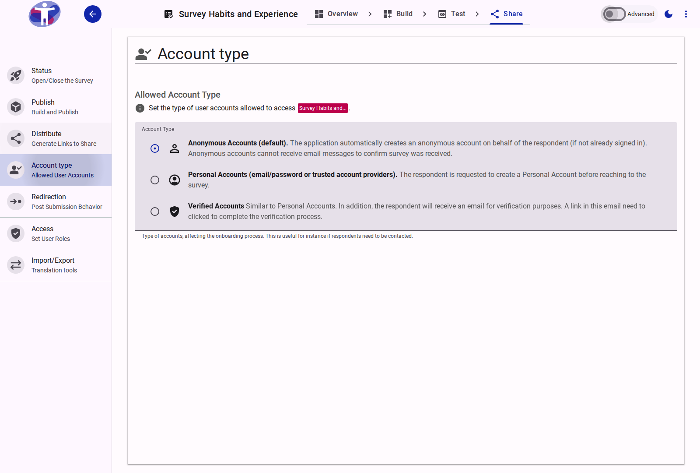
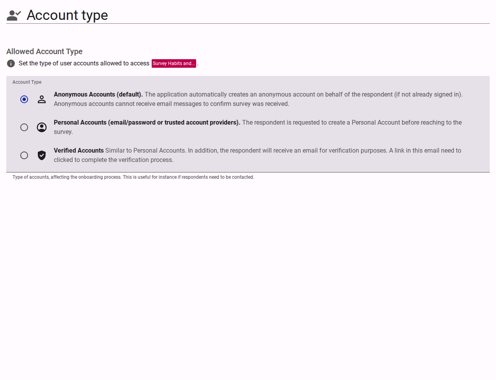

# Respondent Account Types

The **Account Types** page details the authentication requirements for your respondents, dictating how they interact with and access the survey.

<figure>
  
  <figcaption>The survey respondent account types interface</figcaption>
</figure>

## Interface Overview

<figure>
  
  <figcaption>Account type settings content</figcaption>
</figure>

The **Account Types** configuration defines who is eligible to take your survey and what verification is required.

- **Anonymous Accounts (Default)**: Allows anyone with the link to take the survey. No explicit login is required. The application automatically creates an anonymous session on behalf of the respondent. Respondents are invited to upgrade their account to a Personal Account upon submission.
- **Personal Accounts**: Requires respondents to create or log in to an account prior to commencing the survey (e.g., using email/password or a social provider like Google or Facebook). This option tracks user identity across submissions.
- **Verified Accounts**: Similar to Personal Accounts, but additionally requires respondents to verify their email address. Respondents receive a verification email and must click a link. Although they can begin the survey, they may not be considered fully verified until the email is confirmed.
- **Email Invite Only**: Restricts access to a specific list of email addresses. Each respondent receives a unique link.

## Advanced Settings

For detailed authentication configuration, Single Sign-On (SSO), and Multi-Factor Authentication (MFA), see the [Advanced Account Settings](./advanced.md).
