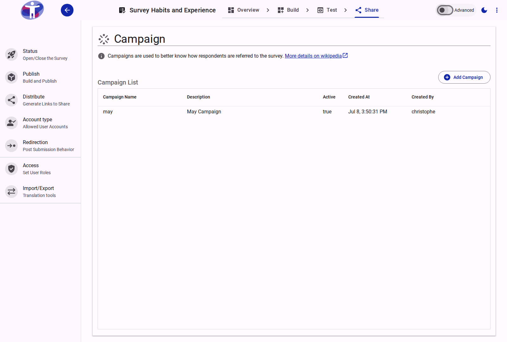

# Campaigns & UTM Tracking

The **Campaign** section allows you to create and manage marketing campaigns for tracking how respondents are referred to your survey using UTM parameters.

The Campaign page is available in **Advanced Mode** from the Share drawer. It lets you create, edit, and manage survey campaigns.

<figure>
  
  <figcaption>The campaign management interface</figcaption>
</figure>

## Campaigns

A **Campaign** represents a named marketing initiative. Each campaign can be toggled active or inactive and stores:

- **Campaign Name**: A short label identifying the campaign (e.g., `spring_promo_2026`).
- **Description**: An optional longer description of the campaign's purpose.
- **Status**: Whether the campaign is active and available for link generation.

Campaigns do **not** store UTM source or medium — those are chosen per link at generation time.

## Link Builder Integration

When a campaign is selected in the **Link Builder**, the generated survey URL is augmented with UTM parameters. The campaign selector appears below the link builder in **Advanced Mode**.

### UTM Parameters

The following tracking parameters can be appended to survey links:

| Parameter | Description | How it's set |
| --------- | ----------- | ------------ |
| `utm_campaign` | The campaign name | Set automatically from the selected campaign |
| `utm_medium` | The channel type driving traffic | Selected per link from a predefined list |
| `utm_content` | Identifies the specific link element clicked | Chosen per link: Logo Link, Text Link, or Image Link |
| `utm_term` | Keyword or audience identifier | Free text entered per link |

The `utm_source` parameter is added automatically by the distribution platform and does not need to be configured manually.

### Content Type Options

The following predefined values are available for `utm_content`:

| Value | Label | Description |
| ----- | ----- | ----------- |
| *(empty)* | No Pre-Selection | No content parameter added |
| `logolink` | Logo Link | The survey logo was clicked |
| `textlink` | Text Link | A text hyperlink was clicked |
| `imagelink` | Image Link | An image banner was clicked |

## Related Content

- [Distribute Your Survey](../distribute/index.md) — Generating links with pre-selected settings
- [Advanced Distribution Settings](../distribute/advanced.md) — Custom tracking and distribution channels
