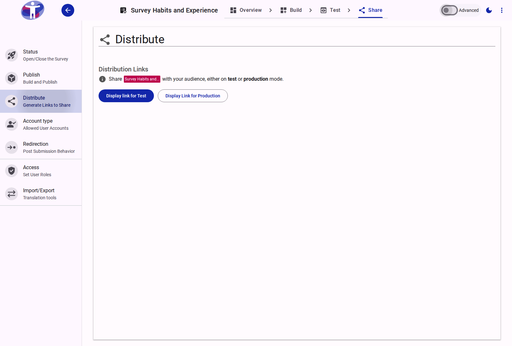
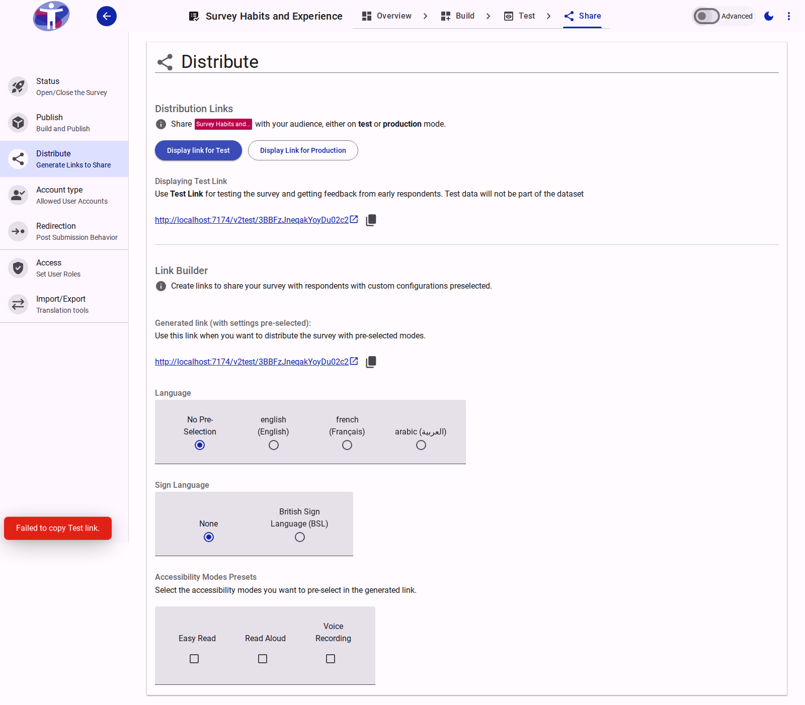

# Distribute Your Survey

The **Distribute** page provides the tools and settings necessary to generate, customize, and copy access links for your survey.

<figure>
  
  <figcaption>The survey distribution interface</figcaption>
</figure>

## Distribution Links

The core of the Distribute page lets you generate access links for different phases of your survey lifecycle:

- **Display Link for Test**: Generates a test URL (using `SURVEY_TEST_URL`). Test links are intended for previewing, testing, and gathered feedback from early respondents. Answers submitted via test links are **not** saved to the production database.
- **Display Link for Production**: Generates the live production URL (using `SURVEY_PROD_URL`). This button is only enabled once at least one survey build has been published. Submissions via this link are recorded as official production dataset responses.

<figure>
  
  <figcaption>The Link Builder interface with generated test link details</figcaption>
</figure>

## The Link Builder

Once you click to display either a test or production link, the **Link Builder** is displayed below. The Link Builder dynamically appends query parameters to your survey URL based on the presets you select:

### 1. Language Presets
If your survey is multilingual and has translations configured, you can pre-select a language for the generated link.
- **No Pre-Selection**: The survey will default to the respondent's preferred browser language.
- **Selected Language**: Appends `?lang=<code>` to force the survey to render in the selected language.

### 2. Sign Language Presets
If sign language modes are active for the survey, you can pre-select a specific sign language dialect.
- Appends `?signlanguage=<code>` to automatically activate the sign language video overlay upon landing.

### 3. Accessibility Modes Presets
Pre-select accessibility modes to be automatically enabled when a respondent opens the link:
- **Easy Read**: Appends `?easyread=true` to render the simplified language version.
- **Read Aloud**: Appends `?readaloud=true` to automatically activate text-to-speech reading.
- **Voice Recording**: Appends `?voice=true` to enable voice response recording features.

Multiple accessibility modes can be combined in the same link.

## Related Content

- [Campaigns & UTM Tracking](../campaign/index.md) — Creating and managing marketing campaigns
- [Advanced Distribution Settings](./advanced.md) — Custom tracking links and campaign selector in Advanced Mode
- [Publishing a Survey](../../how-to/publishing-a-survey.md) — Step-by-step guide to building and sharing versions
