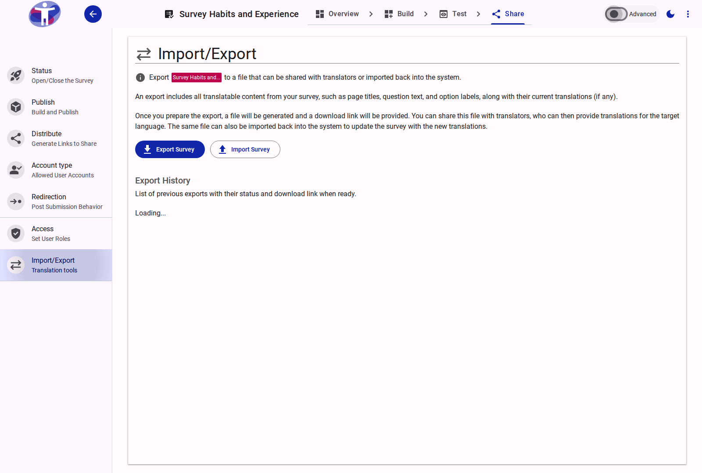
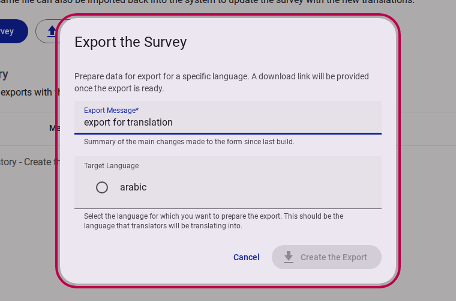
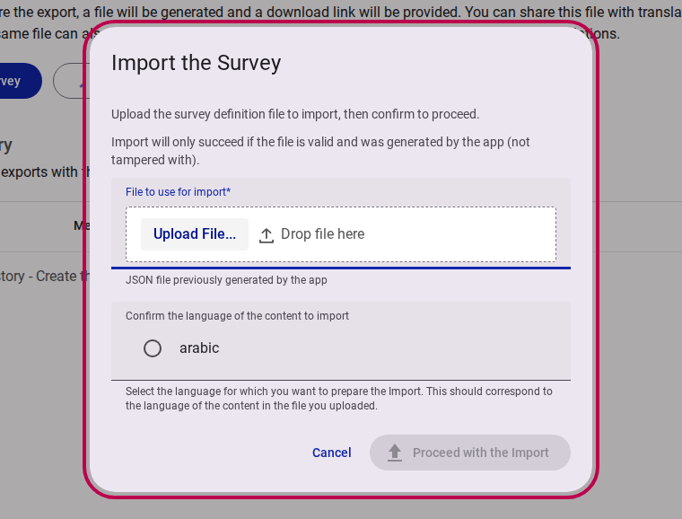
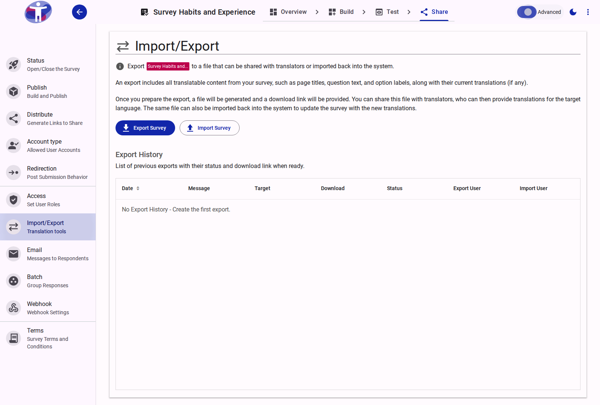

# Import/Export Translations

The **Import/Export** settings provide tools to extract translatable survey content into a file, which can then be shared with translators and subsequently re-imported to update the survey's translations.

<figure>
  
  <figcaption>The Import/Export settings interface</figcaption>
</figure>

## Overview

An export file contains all translatable elements of your survey structure, including page titles, question text, option labels, and any existing translations.

This feature facilitates an external localization workflow:

1. Generate an export file targeted for a specific language.
2. Share the generated JSON file with translators.
3. Import the translated file back into the system to apply the new content.

## Exporting a Survey

To generate a file for translation, select the **Export Survey** action.

<figure>
  
  <figcaption>Export survey dialog</figcaption>
</figure>

When creating an export, you are required to provide:

- **Export Message**: A mandatory summary of the changes or the purpose of this export (e.g., "Initial export for Arabic translation").
- **Target Language**: The designated language that the translators will be translating the content into.

Once initiated, the system prepares the data. A download link for the JSON file will become available in the Export History list once the background process completes.

## Importing a Survey

To apply translations from a previously exported and translated file, select the **Import Survey** action.

<figure>
  
  <figcaption>Import survey dialog</figcaption>
</figure>

::: warning
Import will only succeed if the uploaded JSON file is valid and was originally generated by the application. Files that have been structurally tampered with will be rejected.
:::

When importing, you must provide:

- **File to use for import**: The translated JSON file.
- **Language confirmation**: You must explicitly confirm the language that corresponds to the translated content within the uploaded file.

## Export History

The Export History section maintains a chronological record of all previously generated exports for the survey.

<figure>
  
  <figcaption>Export History table (Advanced view)</figcaption>
</figure>

The list displays the status of each export request and provides the download link for the generated file. When the **Advanced** toggle is active, the history is presented as a detailed table including the date, message, target language, status, and the specific users who initiated the export and any subsequent import.
