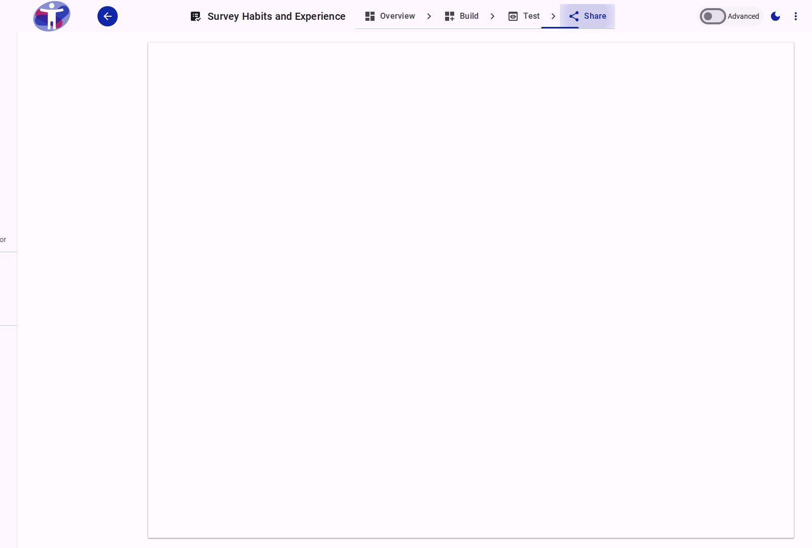

# Sharing Your Survey

This section explains the different methods for sharing your survey and managing how respondents can access it.

<figure>
  
  <figcaption>The survey sharing dashboard.</figcaption>
</figure>

## Interface Overview

The **Share** section is your hub for managing the lifecycle of your survey. From here, you can access all the tools needed to publish, distribute, and monitor your survey.

- **Navigation Menu**: The sidebar or card grid allows you to navigate between different sharing modules:
  - **Status**: Check if your survey is open or closed.
  - **Publish**: Push updates to the live version.
  - **Distribute**: Get links and QR codes.
  - **Access**: Manage user permissions.
  - **Batches**: Schedule availability.
  - **Webhooks**: Configure integrations.

## Contents

### How tos

- [How to share a survey](./sharing-a-survey.md)

### Workflow

- [Sharing Workflow](./sharing-workflow.md)

### Modules

- [Status](./status/index.md)
- [Publish](./publish/index.md)
- [Distribute](./distribute/index.md)
- [Account Type](./account/index.md)
- [Redirection](./redirection/index.md)
- [Access](./access/index.md)
- [Email](./message/index.md)
- [Batch](./batch/index.md)
- [Webhooks](./webhooks/index.md)
- [Terms](./terms/index.md)
