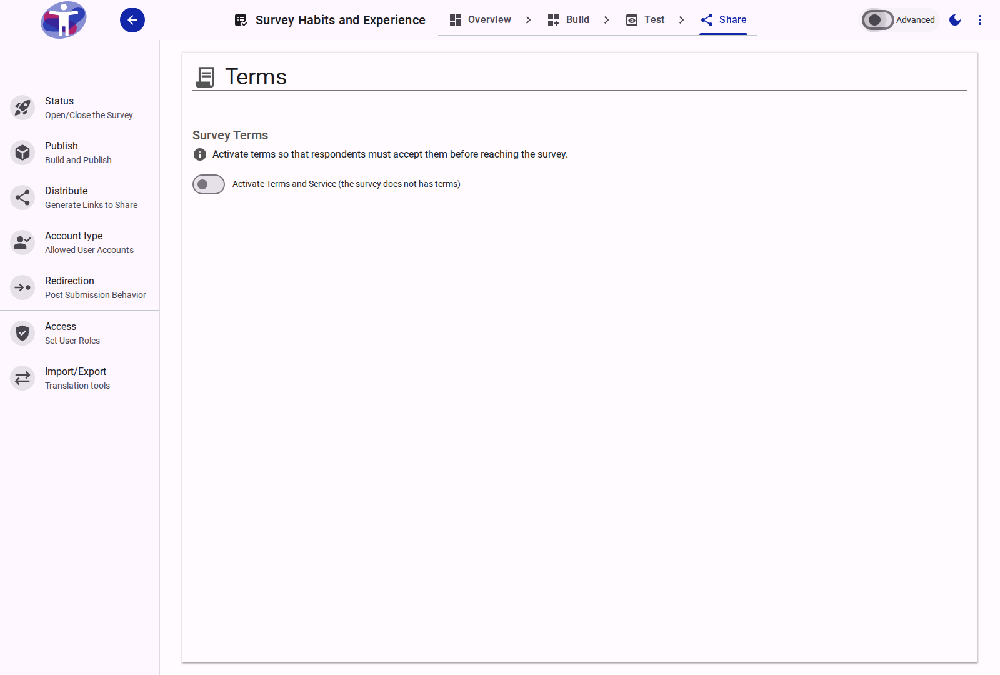
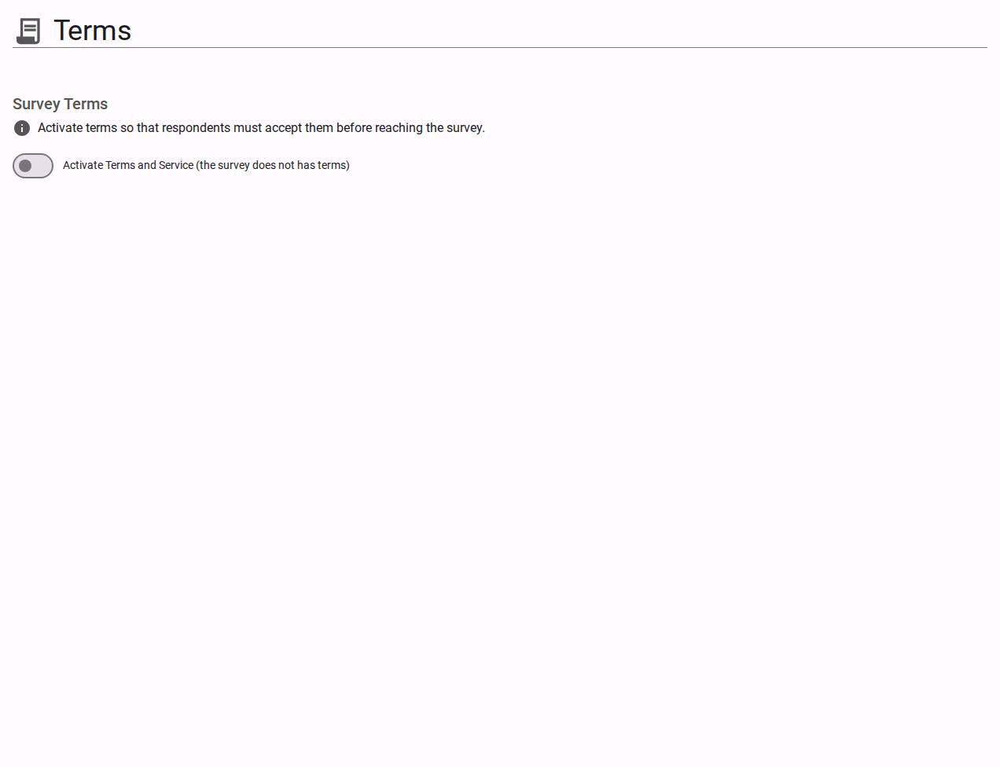

# Survey Terms

The **Terms** page enables you to impose custom legal agreements, consent protocols, or conditions that respondents must explicitly or implicitly accept prior to initiating the survey.

<figure>
  
  <figcaption>The survey terms and conditions interface</figcaption>
</figure>

## Interface Overview

<figure>
  
  <figcaption>Terms settings content</figcaption>
</figure>

By default, all respondents must agree to the platform's overarching terms of service. The **Terms** configuration allows you to inject your organization's specific requirements into this flow.

- **Custom Survey Terms Toggle**: A switch that activates the presentation of your bespoke terms and conditions before the respondent begins the survey.
- **Terms Editor**: A rich text field supporting Markdown syntax. It allows you to format your legal text, embed hyperlinks to external privacy policies, and apply CSS classes specifically designed to respect various accessibility modes (e.g., hiding/showing content for Easy Read mode).
- **Agreement Presentation**: Dictates how the terms are displayed to the respondent.
  - **Popup Window (Default)**: The terms are hidden behind a hyperlink and rendered in a modal window upon interaction.
  - **Plain Text**: The terms are displayed fully inline immediately above the "I agree" sign checkbox.
- **Preview Tab**: Allows you to simulate how your formatted terms and conditions will visually render to respondents before pushing changes live.

*Note: Custom terms can be translated natively into any localized language activated for your survey.*

## Advanced Settings

For configuring specific multi-language terms mappings and tracking explicit document versioning for legal compliance, view the [Advanced Terms Settings](./advanced.md).
