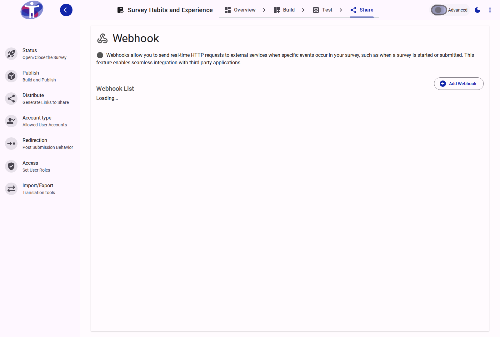
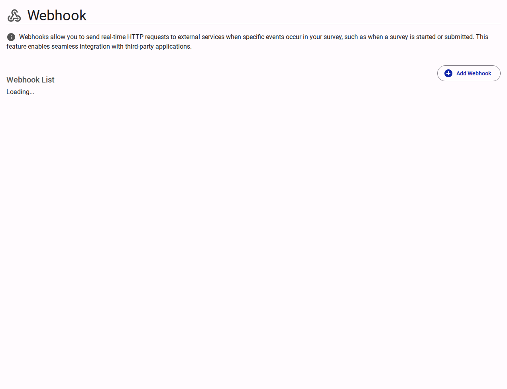

# Survey Webhooks

The **Webhooks** page provides controls to broadcast real-time survey event data to third-party endpoints, facilitating powerful programmatic integrations and automations.

<figure>
  
  <figcaption>The survey webhooks interface</figcaption>
</figure>

## Interface Overview

<figure>
  
  <figcaption>Webhook settings content</figcaption>
</figure>

The **Webhooks** configuration defines precisely where and when survey data payload events are dispatched over the network.

- **Active Webhook List**: A catalog displaying all currently configured webhooks, allowing for rapid auditing of outbound integrations.
- **Add Webhook**: Opens the configuration modal to establish a new outbound HTTP pipeline. The following parameters dictate webhook behavior:
  - **Payload URL**: The exact destination URI where the data payload will be delivered via an HTTP POST request.
  - **Secret Key**: An optional shared cryptographic secret used to sign the request, enabling the receiving server to verify the authenticity and origin of the payload.
  - **Trigger Events**: A checklist defining the conditions that invoke the webhook transmission. Common events include "Response Completed" and "Response Updated."
  - **Status Toggle**: A quick-action control allowing you to temporarily suspend (disable) or resume (enable) the webhook integration without deleting its configuration.

## Advanced Settings

For customizing HTTP headers, structuring exact retry policies, and accessing delivery logs, see the [Advanced Webhook Settings](./advanced.md).
