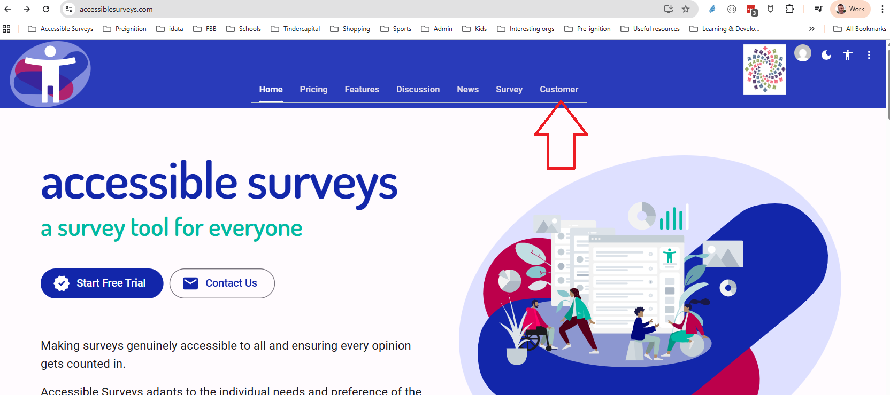
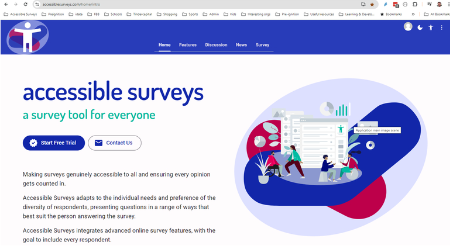

# Session 3: Translating Your Survey

## Overview

In Session 2, you added accessibility options. In this session, you will translate your survey into French and Spanish. The platform supports a wide range of languages, and this process applies to any language.

*Estimated time: 15-20 minutes*

## Learning Outcomes

By the end of this session, you will be able to:

- Add new languages for your 'Organization'.
- Translate your survey into newly added languages.
- Test the translated versions of your survey.
- Translate questions that are added or amended later.
- Understand how language options are presented to respondents.

## Activating Additional Languages

> [!IMPORTANT]
> Only **Account Holders** can activate additional languages for their 'Organization', as this affects the organization's subscription plan.

Languages are added via the 'Customer Portal'. If you created the account or were granted the role, you are an Account Holder.

Account Holders can access the 'Customer' portal from the homepage:

<figure>
  
  <figcaption>Homepage view for an Account Holder.</figcaption>
</figure>

Standard Team Members will not see the 'Customer' portal on their homepage:

<figure>
  
  <figcaption>Homepage view for a Team Member.</figcaption>
</figure>

> [!NOTE]
> If French and Spanish are not already available for your 'Organization', request an Account Holder to add them before proceeding with this session.

## Instructions

Follow along with the video to translate your survey.

<lite-youtube videoid="JNZsL7pmPJQ"></lite-youtube>

## Next Steps

> [!NOTE]
> Congratulations on completing Session 3! You can now proceed to Session 4, where you will learn how to test and share your survey.

[**Start Session 4: Testing and sharing your survey**](session-4-distributing.md)
