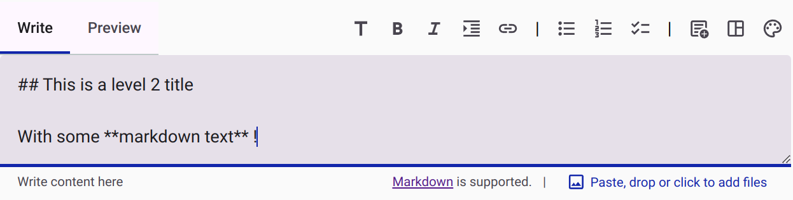
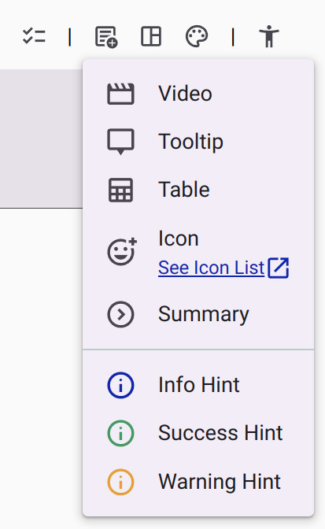
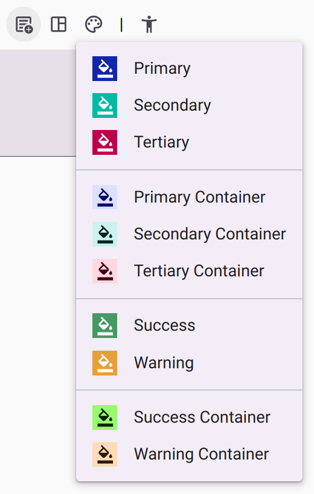
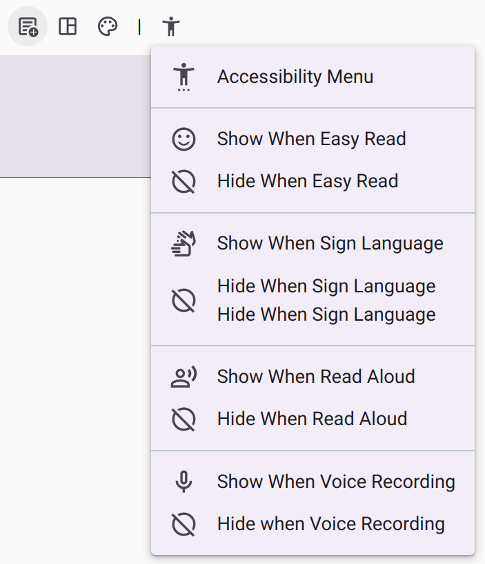
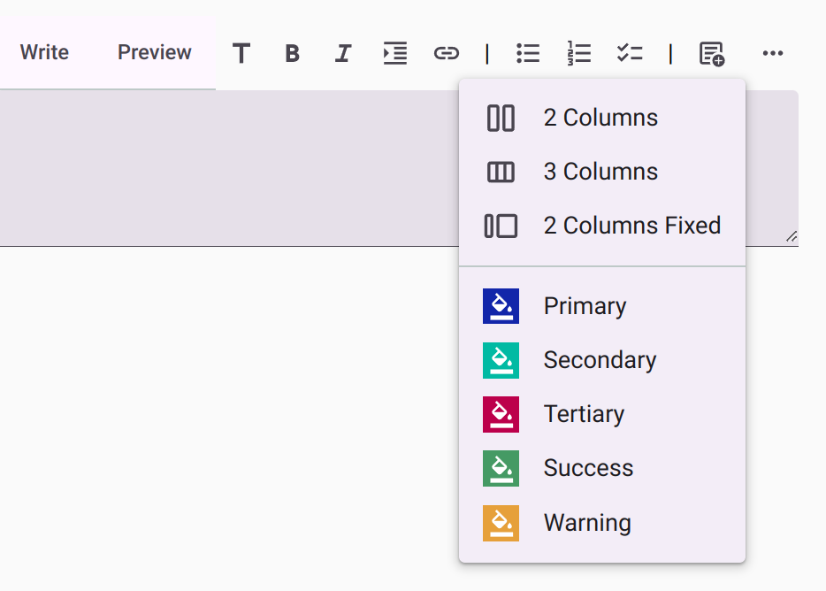

# Rich Text Editor

Many applications within the platform (such as the Survey App and Customer App) utilize a powerful, shared Rich Text Editor (also known as the Markdown Editor). This editor allows you to precisely control content, layout, and style without needing to learn HTML or specific Markdown syntax.

Instead of manually typing code to structure your text, you can use the visual toolbar or convenient keyboard shortcuts.

<figure>
  
  <figcaption>The Rich Text Editor with its toolbar.</figcaption>
</figure>

## Text Formatting and Shortcuts

The editor provides standard formatting options, accessible via the toolbar or keyboard shortcuts:

* **Titles:** Transform text into headings (levels h1 to h6) using the toolbar or shortcuts `Ctrl + 1` through `Ctrl + 6`.
* **Emphasis:** Make text **bold**, *italic*, or underlined using the toolbar or `Ctrl + B` / `Ctrl + I`.
* **Links:** Insert a link with `Ctrl + K`.
* **Lists:** Add bullet points, numbered lists, or task lists using `Ctrl + U` or `Ctrl + O`.
* **Quotes:** Format text as a blockquote with `Ctrl + Q`.

*Note: You can still add pictures directly by dragging and dropping them into the editor.*

## Advanced Content and Widgets

Beyond basic text, the editor supports inserting interactive components and advanced formatting. You can easily insert:

* Videos
* Tooltips (useful for glossaries)
* Tables
* Icons (using the full range of [Material Design Icons](https://fonts.google.com/icons?icon.set=Material+Symbols))
* Summaries (expandable/collapsible text blocks)
* Hint widgets (Information, Warning, or Success callouts)

<figure>
  
  <figcaption>The advanced content insertion menu.</figcaption>
</figure>

## Layout Management

Organizing your content visually is simplified with built-in layout controls. You can add:

* Responsive Columns (2 or 3 columns that stack on small screens)
* Fixed Columns
* Spacing elements (to precisely control vertical whitespace)

## Styling and Colors

Ensuring your colors remain accessible across different themes (like dark mode or high-contrast mode) can be tricky. The editor includes a smart color picker for setting text and background colors that integrates seamlessly with the platform's theming engine.

<figure>
  
  <figcaption>The integrated color picker.</figcaption>
</figure>

## Accessibility Features

The editor is built with accessibility as a core priority:

1. **Keyboard Navigation:** The toolbar is fully navigable via keyboard, strictly following the WAI-ARIA Authoring Practices for toolbars.
2. **Contextual Accessibility Menu:** When used in contexts like a Survey or Form, an additional accessibility menu appears. This menu helps you control which elements are displayed or hidden based on the respondent's active accessibility mode (e.g., showing a specific video only when Sign Language mode is active).

<figure>
  
  <figcaption>The contextual accessibility menu for conditionally displaying content.</figcaption>
</figure>

## Responsive Toolbar

To ensure a smooth editing experience on smaller screens or smaller window sizes, the toolbar is responsive. Any buttons that do not fit horizontally are automatically tucked into a convenient overflow menu on the right.

<figure>
  
  <figcaption>The responsive toolbar with hidden controls accessible via the right menu.</figcaption>
</figure>
