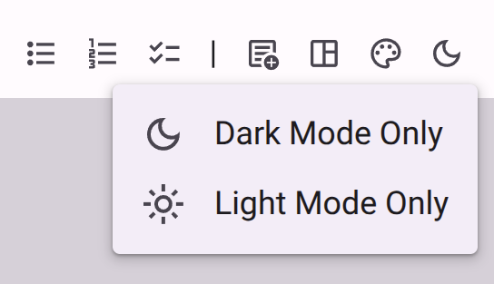

# Theme-Aware Markdown Content

**Date:** 2026-06-05
**Version:** 1.1.6

## Overview

We've introduced a new suite of tools to create Markdown content that automatically adapts to the user's color theme (Light or Dark mode). This makes it easier than ever to manage logos and graphics across different backgrounds without writing complex code.

## What's New?

### Theme-Aware Visibility Classes

* **What it is:** New `.dark-only` and `.light-only` CSS classes that automatically show or hide content based on the active color theme.
* **Why it matters:** Allows survey creators to provide different versions of logos or images that are optimized for either light or dark backgrounds, ensuring perfect legibility at all times.
* **How to use:** Apply the classes to images or wrap text in the new visibility containers.
* **Read more:** [Accessibility Modes Reference](../app/survey/reference/content/markdown/accessibility-mode.md)

### Triple-Colon Directives

* **What it is:** A new, clean syntax for wrapping large blocks of content in visibility containers: `::: dark-only ... :::`.
* **Why it matters:** It's a faster, more readable alternative to using raw HTML `
` tags. It also works for all standard accessibility modes (like Easy Read).
* **How to use:** Simply type `::: class-name` on its own line to start a block, and `:::` to end it.
* **Read more:** [Markdown Reference Index](../app/survey/reference/content/markdown/index.md)

### Markdown Editor Theme Menu

<figure>
  
  <figcaption>The new Theme menu allows you to quickly insert theme-aware content containers.</figcaption>
</figure>

* **What it is:** A new "Theme" menu in the Rich Text Editor toolbar.
* **Why it matters:** Provides one-click access to insert theme-aware blocks, so you don't have to remember the syntax.
* **How to use:** Look for the Dark Mode icon (🌙) in the editor toolbar.
* **Read more:** [Rich Text Editor Reference](../components/md-editor.md)

## Fixes & Improvements

* **Image Attributes:** You can now add classes directly to Markdown images using the `{.class-name}` syntax at the end of the line (e.g., `{.dark-only}`).
* **Mobile Editing:** The new theme actions are fully supported in the responsive toolbar menu for mobile devices.

---
*For a full list of technical changes, see our [internal changelog](https://accessiblesurveys.com/CHANGELOG.md).*
