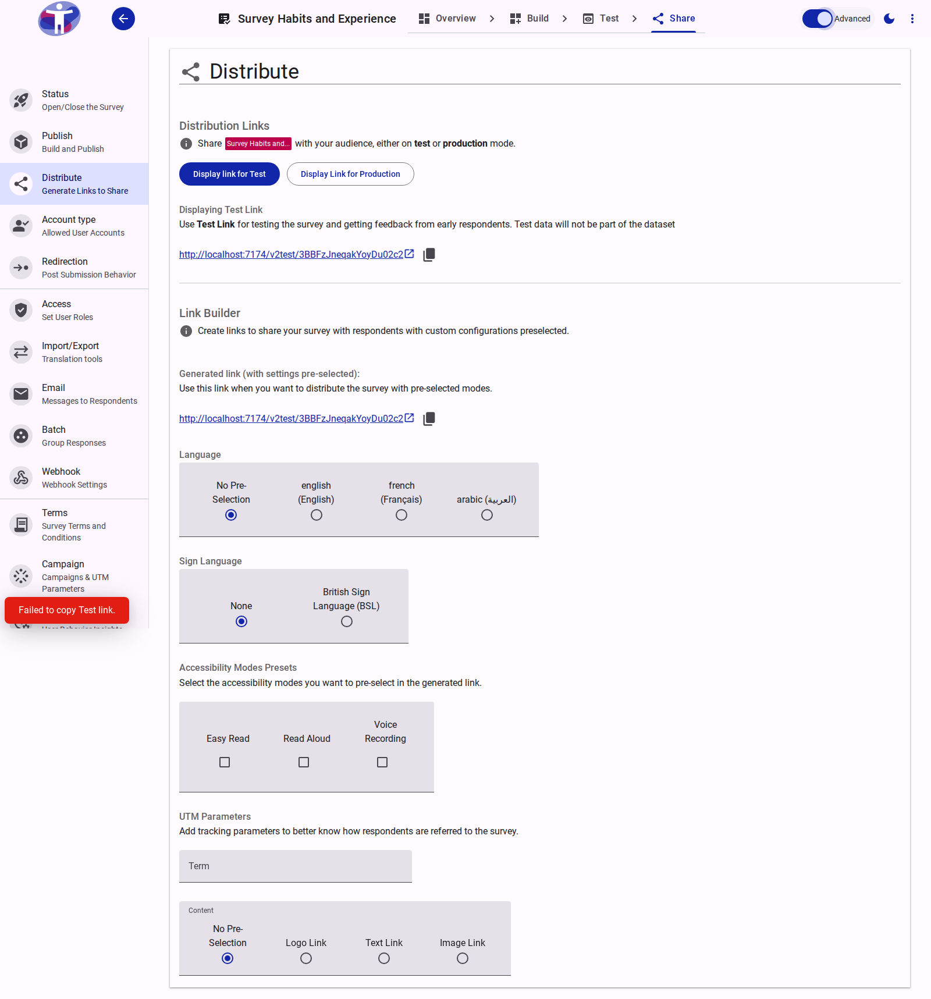
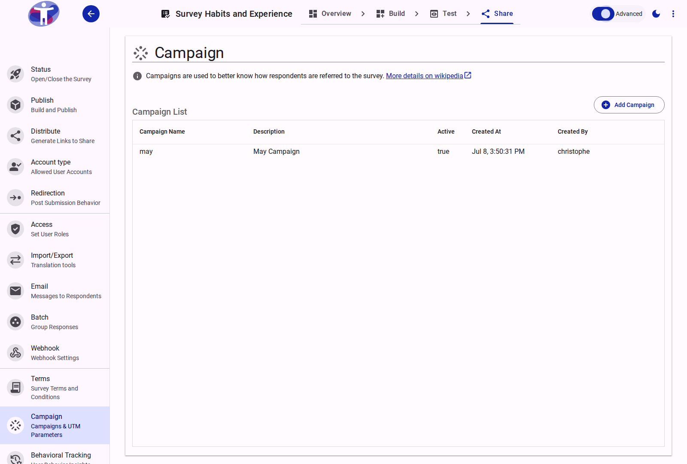

# Marketing Campaigns & Advanced UTM Link Building

**Date:** 2026-07-08
**Version:** v1.1.0

## Overview

We are excited to introduce **Campaigns and Advanced UTM Link Building** for Accessible Surveys! This update allows researchers and marketers to seamlessly track where survey respondents are referred from, group results by acquisition channel, and generate validation-safe query URLs in a completely redesigned Link Builder.

<figure>
  
  <figcaption>The Advanced Link Builder and Campaign Selector interface in Advanced Mode</figcaption>
</figure>

## What's New?

### Centralized Campaign Manager

* **What it is:** A new dedicated **Campaign** management panel in the Share drawer to create, list, and toggle marketing initiatives.
* **Why it matters:** It lets you maintain a structured list of campaigns (e.g., `summer_outreach_2026`, `newsletter_promo`) with descriptive metadata, keeping your analytical attribution organized under a single source of truth.
* **How to use:** Enable **Advanced Mode** in your survey editor toolbar, navigate to the **Share** tab, and click **Campaign** in the drawer to add or edit campaigns.
* **Read more:** [Campaigns & UTM Tracking Reference](../app/survey/reference/share/campaign/index.md)

### Advanced Link Builder & Selector

* **What it is:** An integrated selector below your generated survey URLs that allows you to easily attach tracking parameters without manually formatting links.
* **Why it matters:** Marketers can specify click types (`logolink`, `textlink`, `imagelink`) and input target keywords, which are instantly converted into standard UTM search queries (`utm_campaign`, `utm_medium`, `utm_content`, `utm_term`) appended to a copy-ready URL.
* **How to use:** Display any Test or Production link, toggle **Advanced Mode** on, select a Campaign, choose a Medium (e.g., `email`, `social`), and enter your custom Term and Content presets.
* **Read more:** [Advanced Link Customization & Selector Reference](../app/survey/reference/share/distribute/advanced.md)

<figure>
  
  <figcaption>The Campaign Manager with description and active status fields</figcaption>
</figure>

## Fixes & Improvements

* **Validation-Safe Keywords:** The `utm_term` field now implements a regex validator (`^[a-zA-Z0-9_+ -]+$`) to natively support `+` character overrides and standard alphanumeric characters while preventing encoding conflicts in browsers.
* **Automatic Source Injection:** Removed manual user choice for `utm_source` as this parameter is now automatically managed and injected by the hosting/distribution provider to prevent configuration errors.
* **Clean UI Gating:** Marketing UTM parameters and the Campaign Selector are kept hidden behind Advanced Mode, maintaining a clean and simple Link Builder experience for standard survey sharing.
