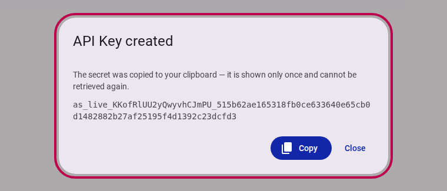
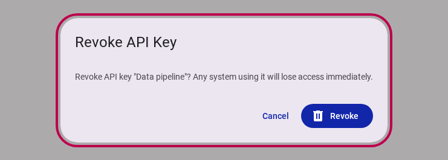

# Team API Keys & Data Definition Endpoints

**Date:** 2026-08-11
**Version:** v1.2.0

## Overview

We are excited to announce **Team API Keys Management** and **Per-Type Data Definition Endpoints** for Accessible Data! This release empowers organizations to securely authenticate external integrations, programmatically inspect data schemas, and integrate automated data pipelines with full type safety.

<figure>
  
  <figcaption>The Team API Keys management interface in Team Settings</figcaption>
</figure>

## What's New?

### Team API Keys Management

* **What it is:** A new dedicated **API Keys** panel in Team Settings (`/customer/{teamId}/team/api-keys`) allowing team administrators to generate, list, and revoke API credentials for programmatic access.
* **Why it matters:** Enables secure machine-to-machine integrations without exposing user login credentials, allowing external scripts, workflows, and data pipelines to interact safely with Accessible Data services.
* **How to use:** Navigate to **Team Settings** in the Customer Portal, select **API Keys**, and click **Create API Key**. Provide a descriptive key name (e.g., `Data Pipeline`) and copy your generated key secret.
* **Read more:** [Team Settings Reference](../app/customer/reference/team/index.md)

<figure>
  
  <figcaption>The API key secret is revealed exactly once upon creation and automatically copied to your clipboard</figcaption>
</figure>

### Single-View Secret Reveal with Auto-Copy

* **What it is:** A high-security key generation workflow where the raw API secret key is displayed exactly once upon creation and automatically copied to the clipboard (`navigator.clipboard`).
* **Why it matters:** Prevents secret leakage or stored plain-text compromises. Once the creation dialog is closed, the key secret cannot be retrieved again—only the key name, key prefix, and creation timestamp remain visible in the dashboard.

### Immediate API Key Revocation

* **What it is:** An in-place revocation workflow allowing team admins to immediately deactivate an API key with real-time feedback and progress tracking.
* **Why it matters:** If an API key is compromised or no longer needed, revoking it instantly cuts off access across all active integrations, maintaining strict security guarantees.
* **How to use:** In the API Keys panel, click **Revoke** next to any active key and confirm in the dialog.

<figure>
  
  <figcaption>Interactive Revoke API Key confirmation dialog with real-time progress indicator</figcaption>
</figure>

### Per-Type Data Definition Endpoints & OpenAPI Documentation

* **What it is:** Programmatic `/definition/{type}` endpoints that expose typed schemas and data definitions for application objects, complemented by an interactive Scalar API Reference.
* **Why it matters:** Developers building custom integrations can programmatically inspect object structures, validation rules, and schema types, guaranteeing type-safe data exchange across services.
* **How to use:** Access the interactive Scalar documentation directly via the new **API Reference** link in the documentation portal.
* **Read more:** [Interactive Scalar API Reference](/api.html)

## Fixes & Improvements

* **Form-Bound Dialog Submissions:** Improved modal dialog form handling so action buttons directly submit associated forms with loading feedback (`lapp-process` and circular spinners).
* **Enhanced Access Control Rules:** Refined user action authorization policies to seamlessly allow owner and admin role permissions across team operations.
