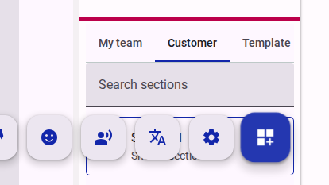
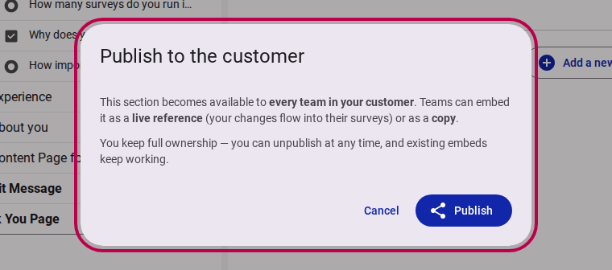
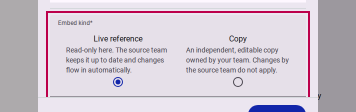
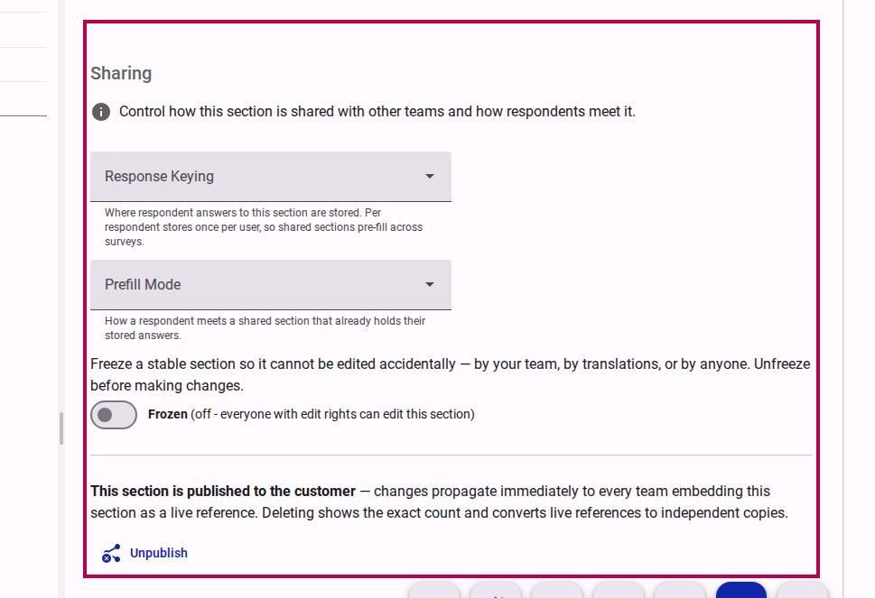
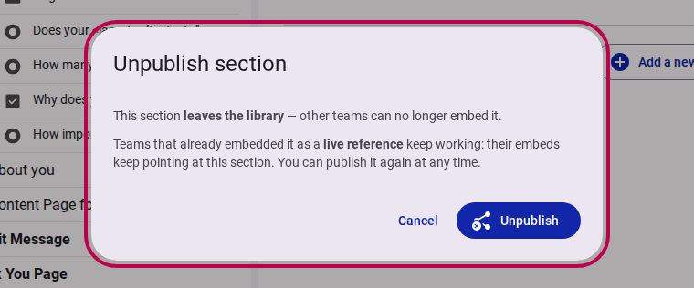

# Section Library, Cross-Survey Sharing & Smart Pre-Fill

**Date:** 2026-08-15
**Version:** v1.3.0

## Overview

We are thrilled to introduce the **Section Library & Cross-Survey Sharing** feature for Accessible Surveys! This release makes it easy to build, standardize, and share rich questionnaire modules—such as the **Washington Group Questions on Disability** or standardized demographic modules—across your entire organization.

Instead of rebuilding questions from scratch for every new survey, teams can now curate verified sections with full multi-language translations, Sign Language video recordings, Easy Read illustrations, and Read Aloud audio assets. Standardized sections guarantee data consistency for longitudinal analysis over time while intelligent **Pre-Fill Modes** eliminate survey fatigue for respondents.

<figure>
  
  <figcaption>The Section Library tabbed browser (My Team, Customer, and Templates) in the survey builder</figcaption>
</figure>

## What's New?

### Centralized Section Library & Publishing

* **What it is:** A browsable section library in the survey designer with three visibility scopes: **Team** (private to the owning team), **Customer** (published and shared with all teams in your organization), and **Global** (curated platform starter templates).
* **Why it matters:** Building accessible questionnaires requires significant effort—recording Sign Language interpretations, drawing Easy Read graphics, and verifying translations. Publishing turns validated sections into organizational assets, ensuring high-quality accessibility standards and consistent baseline data (such as disability status, demographics, or consent) that can be reliably compared over time and across research initiatives.
* **How to use:** In the survey tree view, right-click any section and choose **Publish to customer**. An informative dialog confirms the sharing scope and automatically sets respondent-level storage keying.
* **Read more:** [How to share a section with other teams](../app/survey/how-to/how-to-share-section.md)

<figure>
  
  <figcaption>The Publish confirmation dialog explains how shared sections work across teams</figcaption>
</figure>

### Flexible Embedding: Live References vs. Independent Copies

* **What it is:** When embedding a shared section or template into a form, authors can choose between two embedding models:
  * **Live Reference:** A read-only link to the source section. Upgrades and fixes made by the source team (such as enhanced wording, added languages, or refined accessibility media) automatically propagate to all referencing surveys in real time.
  * **Copy:** An independent, fully detached duplicate created in your form that you can customize and edit freely without affecting the original.
* **Why it matters:** Gives authors complete control over whether they want synchronized standardization across company surveys or a customizable starting point for tailored research.
* **How to use:** Drag any section from the **Section Library** panel onto your canvas, or right-click any page and select **Embed shared section**. Choose **Live reference** or **Copy** in the dialog.
* **Read more:** [How to embed a shared section](../app/survey/how-to/how-to-share-section.md#step-2-browse-the-section-library-embed-a-section)

<figure>
  
  <figcaption>Choose between a synchronized Live reference or an independent Copy when embedding</figcaption>
</figure>

### Cross-Survey Keying & Intelligent Pre-Fill Modes

* **What it is:** Shared sections can store answers per respondent (`user`), allowing respondents to answer questions once and have their responses automatically pre-fill subsequent surveys across the organization. Authors can select the respondent experience with three **Prefill Modes**:
  * **Quiet:** Pre-filled in place with a subtle informative banner, ready for inline edits.
  * **Review:** Collapsed into an elegant summary card allowing respondents to quickly review or expand to update.
  * **Interstitial:** An upfront decision step asking respondents if they would like to keep previous answers or make changes.
* **Why it matters:** Eliminates repetitive data entry for common questions (e.g., accessibility requirements or demographic profiles), dramatically boosting completion rates and user satisfaction.
* **How to use:** Enable **Advanced Mode** in the survey editor, click on any section, and navigate to the **Sharing** section settings to select **Response Keying** and **Prefill Mode**.

### Section Freezing & Tree Grid Indicators

* **What it is:** An opt-in **Freeze** switch that locks a stable section against accidental edits (including translations and deletions) for all users, alongside new tree grid indicator icons (`share` for shared sections and `link` for live references).
* **Why it matters:** Protects critical modules that are actively referenced by multiple surveys, ensuring live references remain stable.
* **How to use:** In section settings under **Sharing**, toggle the **Frozen** switch on. Unfreeze whenever intentional modifications are required.

<figure>
  
  <figcaption>The Sharing settings panel in Advanced Mode displaying Response Keying, Prefill Mode, and Freeze controls</figcaption>
</figure>

## Fixes & Improvements

* **Out-of-Form Accessibility Resolution:** The survey build pipeline now automatically discovers live-referenced sections and resolves their Sign Language videos, Easy Read images, audio files, and translation maps across forms into the compiled survey package.
* **Question ID Collision Warnings:** Build-time analysis detects duplicated question identifiers or namespace clashes when embedding sections, providing clear warnings without halting survey compilation.
* **Zero-Dangle Deletion Safeguard:** Deleting a section that is actively embedded as a live reference by other surveys automatically converts those live references into independent copies before deletion, guaranteeing that dependent surveys never break.
* **Unpublish Confirmation:** Unpublishing a section removes it from organizational libraries while seamlessly preserving all existing live reference embeds.

<figure>
  
  <figcaption>Unpublishing removes the section from libraries while keeping existing embeds fully functional</figcaption>
</figure>

## Related Documentation

* [How to share a section with other teams](../app/survey/how-to/how-to-share-section.md)
* [Sharing Content across Forms and Surveys](../app/survey/how-to/sharing-content.md)
* [How to share options across multiple questions](../app/survey/how-to/sharing-options.md)
* [How to share logical expressions across multiple items](../app/survey/how-to/sharing-logical-expressions.md)
