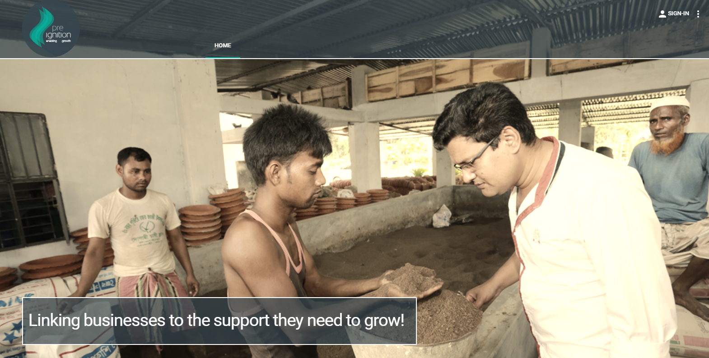
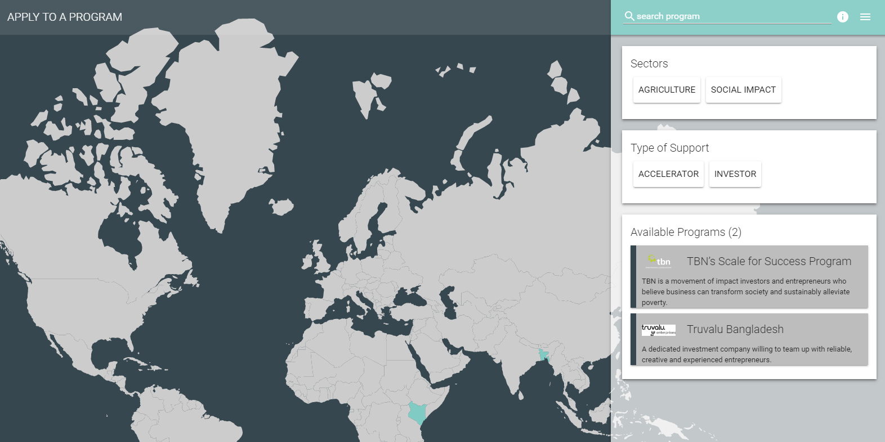

# Introduction

## Purpose

This user guide is intended to provide entrepreneurs with clear instructions so they can use Preignition effectively.

## Audience

The audience for this user guide are entrepreneurs who use Preignition to apply to and communicate with accelerator programs and impact investors.

Entrepreneurs will only access a few areas of the platform such as the homepage and entrepreneurs space. The user experience is highly intuitive and there should be no need to refer to this User Guide.

Please contact help@preignition.org if these instructions are not clear or if you still have questions.

## Homepage

* The homepage can be accessed at [preignition.org](https://preignition.org/main/home) 
* The homepage currently looks like this.

## Applying for a program

* The homepage has a section where programs which support early stage businesses are listed
* These can be filtered by sector, type of support and geography
* Currently it lists the two programs which are piloting Preignition, TBN in Kenya and Truvalu in Bangladesh
* Entrepreneurs can apply for these programs directly from the homepage

