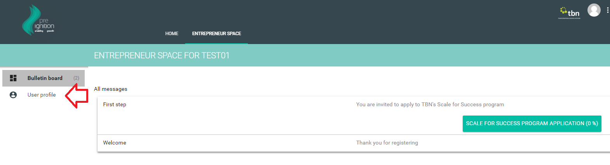
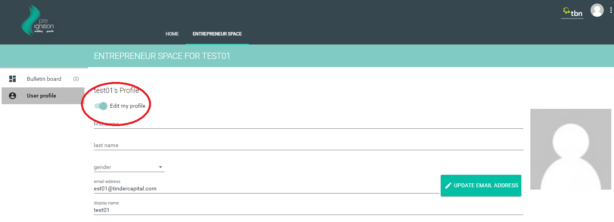
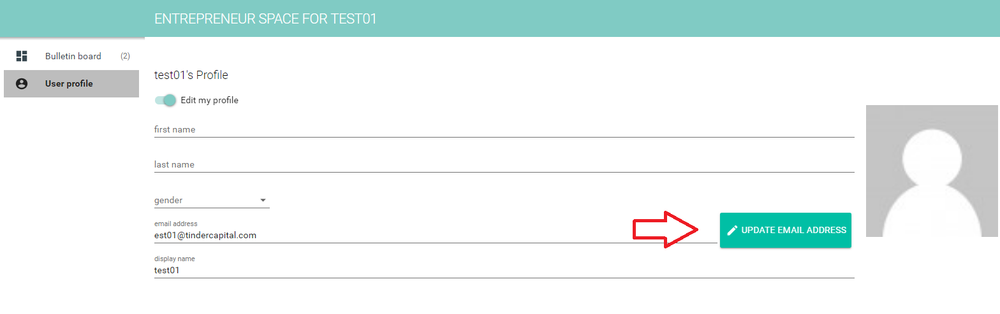
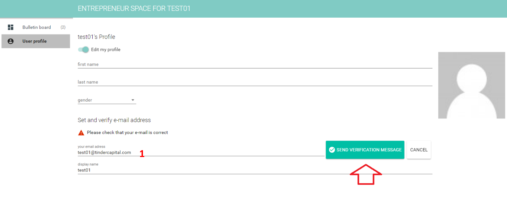
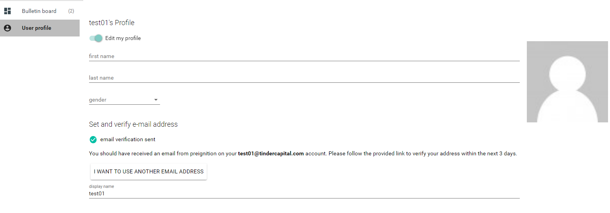
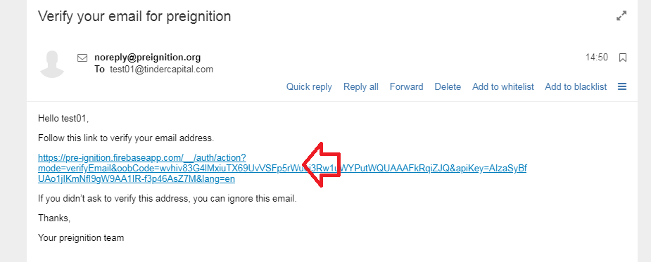
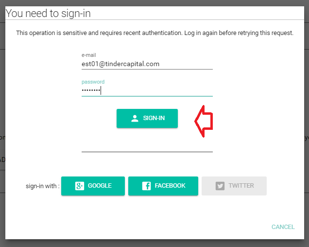
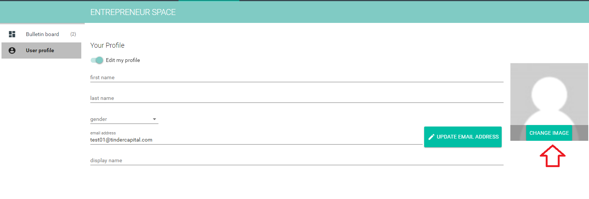
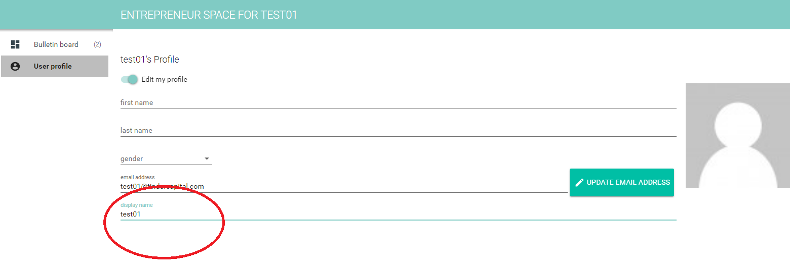

# User profile

## Step 1- Overview of the User Profile page 

* Entrepreneurs can customize their user profile from their entrepreneur space

## Step 2- Editing a profile 

* Activate the slider entitled 'Edit my profile'

* All fields on this page can now be edited, including
  * Name
  * Gender
  * Email address
  * Display name

## Step 3- Updating an email address 

* The example below shows the process of updating an email address from est01@tindercapital.com to test01@tindercapital.com
* Click on 'Update email address'

* Enter your new address at 1 \(test01@tindercapital.com\)
* You will be asked to send a verification message to this new email address

* You will see a message confirming that a verification message has been sent to the new email address

* Check your email account and verify the new email address

* In some instances, such as if the account hasn't been used recently, you may encounter an additional security check.
* Before the email address is updated you will have to enter your old email address and password.
* Enter your old email address here, ie est01@tindercapial.com

## Step 4- Updating a profile picture 

* Hover over the image\_guide field and click on the heading 'change image\_guide'
* You will now be able to select an image\_guide stored on your computer

## Step 5- Updating a display name 

* The display name is important as it is used throughout the platform to refer to the user.
* It can be updated by simply updating the 'display name' field

