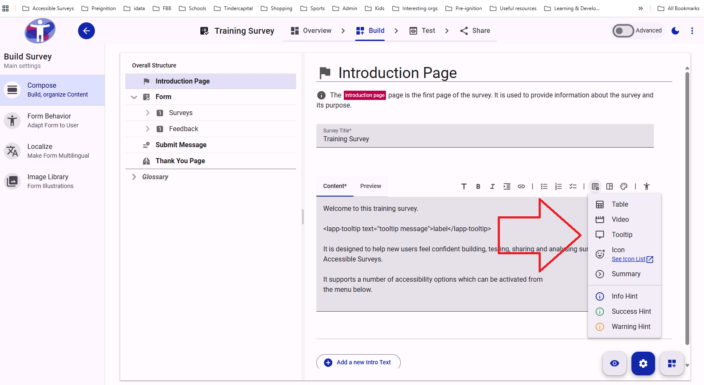

# Customer Portal

The Customer Portal is a restricted part of the platform and can only be accessed by Account Holders. &#x20;

It allows Account Holders to control all aspects of their account on Accessible Surveys. &#x20;

<figure><figcaption></figcaption></figure>


The screenshot above shows how the customer portal can be accessed from the homepage by Account Holders.  If you can't see 'Customer' in the top menu, you do not have the necessary rights to access this part of the application.


This Customer Portal is currently under development.   However you can already complete key tasks like reviewing your subscription and adding members to your account or to a specific team.

The first section is labelled [‘Portal’.](main-settings/)  This is where you can view and edit the main account settings. &#x20;

The second section is labelled [‘Team’.](presentation.md)  This is where you view and edit the settings for a specific team.
