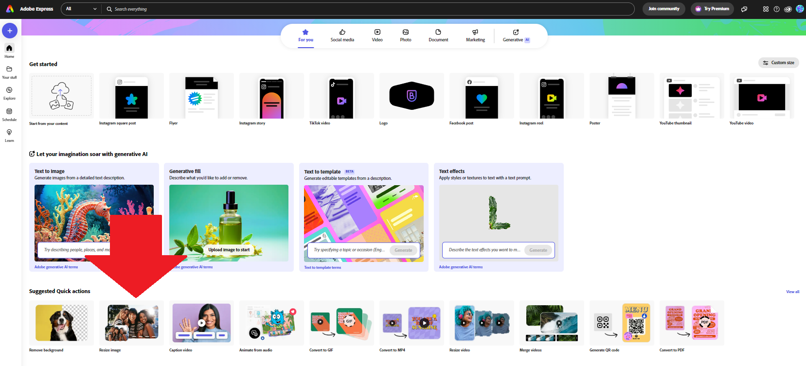

# Text based questions


Text based questions are questions which are responded to by entering text or numbers


## Step 1

Initially two text based question type are visible

* Text
* Long Text

<figure><figcaption>
Screenshot showing text and long text question types
</figcaption></figure>

## Step 2

Clicking on the <mark style="color:blue;">**^**</mark> symbol beside the 'Text' label reveals some additional text based questions

<figure><figcaption>
Screenshot showing additional text based questions
</figcaption></figure>

## Step 3

A text based question looks like this

<figure><figcaption>
Screenshot showing the input options for a text based question
</figcaption></figure>

## Step 4

Under 'Designation' give the question a label.


The 'label' is how the questions will appear on the form. Make it as clear and concise as possible. Avoid long questions as they won't render well on small screens or mobiles


<figure><figcaption>
Screenshot showing a 'label' being written for a text question
</figcaption></figure>

## Step 5

Always check the 'Accessibility' box under the label.   This will make sure that the label 'wraps' on small screens if you have a long label.


It is good practice to keep labels short and concise.  Helper text can be used to provide additional information about the question if needed


<figure><figcaption>
Screenshot showing the location of the 'Accessibility' box
</figcaption></figure>

Selecting the 'more accessible label' option allows you to write the label in markdown. &#x20;

This means you can add styling to your question label and also allows you to include 'tooltips' to explain difficult words.&#x20;

See seperate Guidance Notes on [Using Markdown](../introduction-to-markdown.md) and [Using Tooltips](../using-tooltips.md)

## Step 7

Select the 'Validation' box if you require Respondents to answer the question

If Respondents don't answer a required question, they will be told that they have missed a required question immediately.   They will be able to continue to fill in the survey but will be redirectly to complete required questions before they can submit their survey.   All prompts are announced to Screen Readers.&#x20;

<figure><figcaption>
Screenshot showing the location of the 'Validation' box
</figcaption></figure>

## Step 8

It is possible to set a maximum character length for text answers and to show the character counter to respondents.  There will be no restrictions on the length of answers if no maxium length is set.

## Step 9

The other text based questions operate in the a similar way. The main differences are as follows:

* Currency and number questions provide an options for setting a maximum and minimum value for answers
* Date questions require Respondents to enter a date in the format dd/mm/yyyy
* Email questions require Respondents to enter a recognised email format ie the answer must include @ to be accepted
* Long text gives an option to set the number of rows that will be visible and the maximum number of rows that are available


Congratulations- you can now add text based questions!

