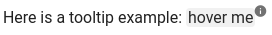
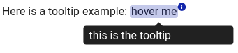
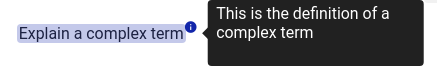
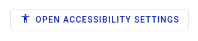
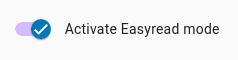
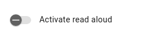
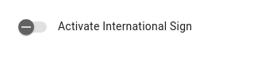
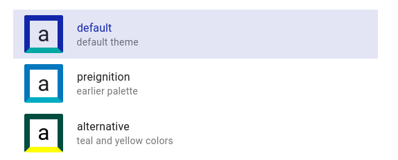
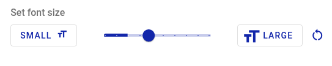

# Convenient web components to be user in AccessibleSurveys.com Free text field

This document describes the web components that can be used in the free text field of AccessibleSurveys.com.


Web component tag MUST be closed: `<lite-youtube videoid="xVytWVHX4N0"></lite-youtube>` and not `<lite-youtube videoid="xVytWVHX4N0">`



### Tooltips
#### pwi-tooltip

An element for displaying tooltip. Tooltip provide additional content when focused or hovered.

###### Example

```html
Here is a tooltip example: <pwi-tooltip message="this is the tooltip" position="bottom">hover me</pwi-tooltip>
```

Produces: 

> 

When a user over the tooltip with or activate it : 

> 

###### Properties

| Property      | Attribute     | Type      | Default | Description                                      |
|---------------|---------------|-----------|---------|--------------------------------------------------|
| `container`   | `container`   | `object`  |         | the `container` used to decide how to position tooltip before opening. |
| `fireonclick` | `fireonclick` | `boolean` |         | When true, activate tooltip on click event (and not just on hover) |
| `heading`     | `heading`     | `string`  |         | Tooltip title.                                   |
| `message`     | `message`     | `string`  |         | message appearing when tooltip is active         |
| `noIcon`      | `noIcon`      | `boolean` | false   | Do not display the `info` icon top right of tooltip when true |
| `opened`      |               | `boolean` | false   |                                                  |
| `position`    | `position`    | `string`  |         | Placement of the tooltip. Note that the actual placement may vary as needed to keep the tooltip<br />inside of the viewport  {'top' \| 'top-start' \| 'top-end' \| 'right' \| 'right-start' \| 'right-end' \| 'bottom' \| 'bottom-start' \| 'bottom-end' \| 'left' \| 'left-start' \| 'left-end'  } |
| `skipFocus`   | `skipFocus`   | `boolean` |         | tooltip is not activatable by tap if true. <br />To use for instance when sloted element is a button (which will receive focus) |
| `tipwidth`    | `tipwidth`    | `string`  | 200     | Wdth of the tooltip - overrides css properties.  |

### pwi-form-tooltip

Tooltips to be user in forms. It allows to display glossary definition 
for complex terms used in the form. 

#### Example

Usually, only `term` property should be used: 

```html
<pwi-form-tooltip term="complexterm">Explain a complex term</pwi-form-tooltip>
```

Produces: 

> 

#### Properties

| Property         | Attribute        | Type      | Default                      | Description                                      |
|------------------|------------------|-----------|------------------------------|--------------------------------------------------|
| `appName`        | `app-name`       | `string`  |                              | `appName`                                        |
| `container`      | `container`      | `object`  |                              | the `container` used to decide how to position tooltip before opening. |
| `fireonclick`    | `fireonclick`    | `boolean` |                              | When true, activate tooltip on click event (and not just on hover) |
| `heading`        | `heading`        | `string`  |                              | Tooltip title.                                   |
| `loadingMessage` | `loadingMessage` | `string`  | "loading remote tooltip ..." | `loadingMessage` message appearing before<br />remote content was loaded |
| `message`        | `message`        | `string`  |                              | message appearing when tooltip is active         |
| `noIcon`         | `noIcon`         | `boolean` | false                        | Do not display the `info` icon top right of tooltip when true |
| `opened`         |                  | `boolean` | false                        |                                                  |
| `path`           | `path`           | `string`  |                              | `path` database path                             |
| `position`       | `position`       | `string`  |                              | Placement of the tooltip. Note that the actual placement may vary as needed to keep the tooltip<br />inside of the viewport  {'top' \| 'top-start' \| 'top-end' \| 'right' \| 'right-start' \| 'right-end' \| 'bottom' \| 'bottom-start' \| 'bottom-end' \| 'left' \| 'left-start' \| 'left-end'  } |
| `resource`       | `resource`       | `object`  |                              | `resource` the resource object to get<br />context from. It can be a form or a section.<br />For editor shall not set this propery as it is handled by the application. |
| `skipFocus`      | `skipFocus`      | `boolean` | true                         | tooltip is not actiabtable by tap if true. <br />To use for instance when sloted element is a button (which will receive focus) |
| `term`           | `term`           | `string`  |                              | `term` the term id to get tooltip for            |
| `tipwidth`       | `tipwidth`       | `string`  | 200                          | Wdth of the tooltip - overrides css properties.  |


## Guidance - `<pfo-survey-guidance>`
### pfo-guidance

An element displaying Guidance on how to use iData 
and how to till out forms.

Guidance appear in the active application language.

#### Example
```html
<pfo-guidance></pfo-guidance>
```
will display iData Form guidance.

### pfo-guidance-video

An element displaying a video on on how to use iData 
and how to till out forms.

The video adapts to active language

#### Example
```html
<pfo-guidance-video></pfo-guidance-video>
```
will display iData Form guidance.
  
## Icons

It is sometime helpful to add icons directly in the text. [Material icons](https://fonts.google.com/icons) are available through the following syntax: 

```html
<md-icon>sentiment_satisfied_alt</md-icon>
```

Produces:


## Video - `<lite-youtube>`

The element for rendering youtube video is [lite-youtube](https://github.com/paulirish/lite-youtube-embed). 

#### Properties

  | Name           | Description                                        | Default |
  | -------------- | -------------------------------------------------- | ------- |
  | `videoid`      | The YouTube videoid                                | ``      |
  | `playlabel`   | label for the play button                           | `Play`  |
  | `params`       | Set YouTube query parameters                       | ``      |

#### Example

Use any [YouTube Embedded Players and Player Parameters](https://developers.google.com/youtube/player_parameters) you like. 
We recomend setting `modestbranding` to `2` and `rel` to `0` as below to minimize youtube branding and avoid showing related video 
after the video was just played.

```html
<lite-youtube videoid="xVytWVHX4N0" params="modestbranding=2&rel=0"></lite-youtube>
```

## Accessibility

### a11y-menu

A menu for accessibility settings. It allows to activate, unactivivate 
or change settings for application theme and contrast, text size, easyread 
or simplified interface. 

In context of forms or survey, it also display readaloud and Internation Sign 
settings. 

#### Example

```html
<a11y-menu context="survey"></a11y-menu>
```
produces: 
> 

#### Properties

| Property  | Attribute | Type     | Description                                      |
|-----------|-----------|----------|--------------------------------------------------|
| `context` | `context` | `string` | used to show or hide specific accessility items depending on application context. <br />For instance, `readaloud`. `internationl sign` are visible only when context = `survey`. |

### a11y-dialog-button

A Button opening the application's accessibility menu.

It renders with `open accessibility settings` label and an accessibility Icon

#### Example
`<a11y-dialog-button outlined></a11y-dialog-button>`

Produces: 

> 


#### Properties

| Property     | Attribute    | Type      | Description                                      |
|--------------|--------------|-----------|--------------------------------------------------|
| `outlined`   | `outlined`   | `boolean` | Creates an outlined button that is flush with the surface. |
| `unelevated` | `unelevated` | `boolean` | Creates a contained button that is flush with the surface. |

*`a11y-dialog-button` was previously `pfo-accessibility-settings`, which is now deprecated* 


### Individual accessibility controls
Individual controls exists for each accessibility settings. We recommend the use of `<a11y-menu context=form></a11y-menu>` in forms as it is more compact. 

However there are cases where it makes sense to introduce each accessibility controls individually. 

| Control            | Description       | Example |
|--------------------|-------------------|---------|
| `<a11y-easyread></a11y-easyread>` | On/Off easyread accessibility settings   | >  |
| `<a11y-readaloud></a11y-readaloud>` | On/Off readaloud accessibility settings   | >  |
| `<a11y-signlanguage></a11y-signlanguage>` | On/Off International Sign (IS) accessibility mode   | >  |
| `<a11y-theme></a11y-theme>` | Display a list of available themes   | >  |
| `<a11y-font></a11y-font>` | set font size  | >  |

