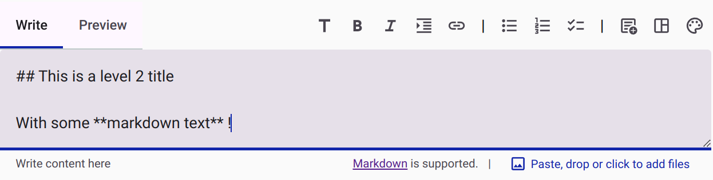
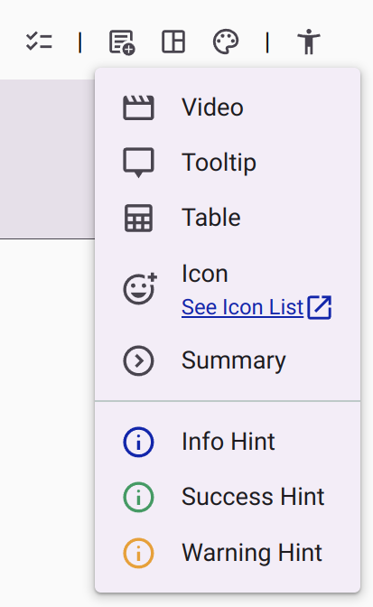
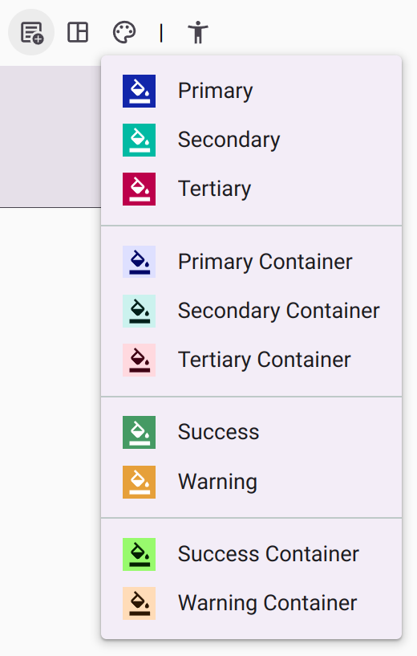
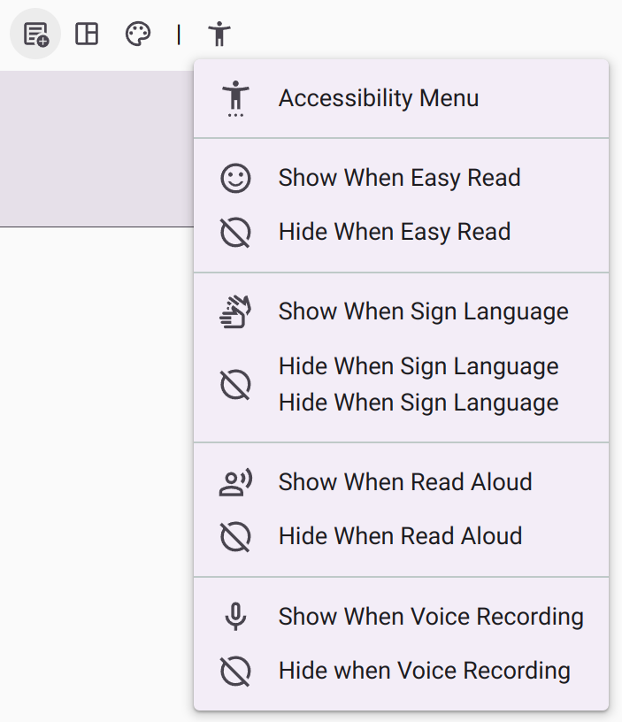
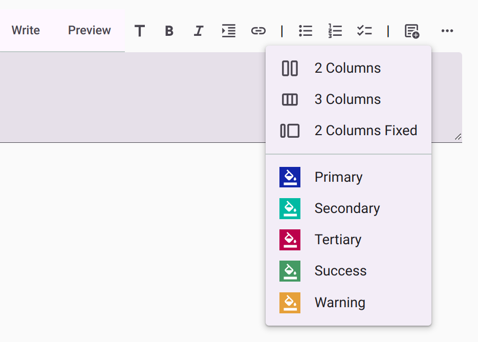

# Markdown Editor Release Notes

Accessible Surveys free-text editor is very powerful. It allows users not only to control content, but also layout and style. It supports some advanced widgets or interactive components like video or accessibility menu. It event reacts to accessibility mode, allowing to show or hide content depending on user's preferences.

Until now, there was a catch. To fully leverage its power, users had to master certain techniques, such as Markdown or HTML, or to remember specific syntax. This was demanding a high investment.

We just released a new version of the free-text editor that makes it much easier to use. **Instead of typing specific syntax to control the layout (adding 2 columns for instance), you can now just press a toolbar button or use a keyboard shortcut**. The editor will take care of the rest.

> 
>
> The new editor with its toolbar.

## New features

The new version now improves way to :

- Set the text as a title, with different levels (h1, h2, h3, h4, h5, h6). Selected text will be transformed into a title when clicking on the respective button, or using the keyboard shortcut `Ctrl + 1` to `Ctrl + 6`;
- Make the text bold or italic. Selected text will be transformed into bold, italic, or underlined when clicking on the respective button, or using the keyboard shortcut `Ctrl + B` or `Ctrl + I`;
- Add a link. Selected text will be transformed into a link when clicking on the respective button, or using the keyboard shortcut `Ctrl + K`;
- Add lists (bullet points, numbered, or task list). Selected text will be transformed into a list when clicking on the respective button, or using the keyboard shortcut `Ctrl + U` or `Ctrl + O`;
- Add a quote. The keyboard shortcut is `Ctrl + Q`;

Adding pictures by drag and drop continues to be possible.

This new version improves the way to add interactive components or specific syntax. There are controls to add :

- Videos,
- Tooltips,
- Tables,
- Icons, with the full range of [Material Design Icons](https://fonts.google.com/icons?icon.set=Material+Symbols),
- Summary (text that expand or collapse on user click),
- Different hint widgets (information, warning or success),

> 
>
> The new content menu

Layout management is simplified. You can now add :

- Responsive Columns (2 or 3),
- Fixed Columns,
- Spacing elements

In terms of colors, it is not easy to set theme colors so that your design is consistent and adapts to used preference (for instance dark mode, or strong contrast accessibility themes). The new version provides a color picker to set the text or background color.

> 
>
> The new color picker

## Accessibility

The new version is fully accessible. It is possible to navigate through the toolbar using the keyboard (it follow the pattern of the [WAI-ARIA Authoring Practices](https://www.w3.org/WAI/ARIA/apg/patterns/toolbar/) for a toolbar).

When relevant, for instance when the editor is used in the context of a `survey` or a `form`, an additional accessibility menu is displayed. It allows to simplify handling of elements that should be displayed or hidden depending on user's active accessibility mode.

> 
>
> The accessibility menu in the toolbar

## Responsive design

When there is not enough space to display all the toolbar buttons, an additional menu is displayed that contains controls hidden.

> 
>
> The responsive toolbar, with hidden controls now present on the right menu.

