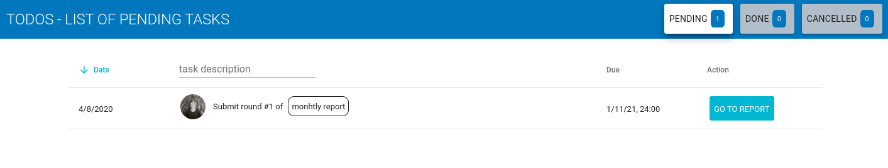

# Reporting



Preignition is proud to announce the launch of its new reporting feature. It enables programs to collect  information from users on recurrent basis. For instance, quarterly or annually progress reports from key businesses. It also allows to easily monitor and drive this data collection exercise. 

The reporting feature leverages Preignition [survey ](form-builder/)and [process](process-builder.md) builders to provide a flexible tool both in terms of the content collected and the steps involved \(e.g. sending recurrent email invite\).

The reporting feature is an important component in a more comprehensive Monitoring and Evaluation package, allowing to bind information regularly collected with program key indicators.

But first, let us see what it changes for users responsible for reporting. 

### Reporting Users 

Reporting users receive emails and/or notifications inviting them to take part in the reporting exercise. 

Clicking on provided links drives users to their respective reporting form. 

The Todo page also keep track of pending reporting tasks.

Let us now focus on the new report editor. 

### Report Editor

The report editor presents 4 sections: Overview, When, What, Who and Activity, briefly described below.

#### Overview

The **Overview** section presents a summary of reporting settings, along with an activation tool, in charge of scheduling reporting instances. 

#### When

As its name indicates, the **When** section allows users to set when reports should be scheduled. This involves a starting date, a reporting frequency and possibly an end date. Users can also decide how long responsible person for sending the report will be allocated to. 

#### What and Who

Here, users devise which form shall be used, and who is going to be involved in the reporting exercise.

The application provides various rules to define business groups. They can be defined by selection processes, states or batches in selection processes, labels being applied to businesses or even ad-hoc lists.

#### Activity

An Activity tab provides the list of all past reporting instances, with completion details, persons involved in reporting and access to provided information. 

