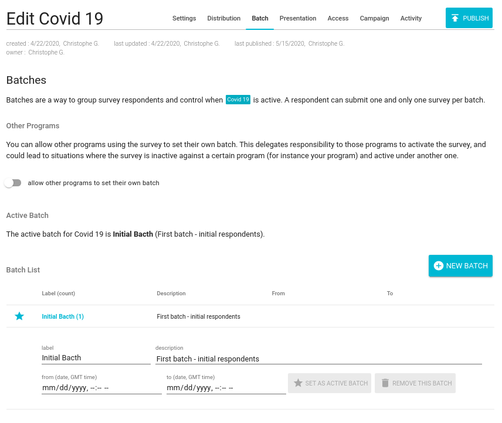

# Survey

Preignition is launching a new Survey Tool! Here is the release note.

The application already has a [Form Builder](form-builder.md) and a [Reporting](reporting.md) tool for recurrent data collection. The new survey tool allows to launch one-off data collection exercices. 

### Survey Application

#### Settings

The settings page allows users to provide a name to the survey, and chose the relevant Form and its version. 

The application informs the user whether the survey is currently active or not. 

#### Distribution

User can chose how the Survey is distributed. Either by using a link that can be shared, or selecting group of users to receive an invitation email, or through social media. Email and social media distribution channels are not yet activated. 

Up to 5 alias can be set, so as to provide a simpler link to the survey.

#### Batch

Batches enable survey editors to group responses. It also allows to set a starting and ending date for a data collection exercise. As Other programs can re-use a survey, survey editors can decide to delegate the responsibility to those program to set their own independent batches.

#### Activity

The Activity page provides a summary of how busy the survey was the last month. It also display the number of users currently responding to the survey \(in real-time\).

### Accessing a Survey for Data Entry

Once a survey is created and active, users can access it through the chosen distribution channels. First time they access a survey, they will be guided though a stepper informing them about the current survey \(presentation above\), asking them to create an account \(or continue as guest users\) and requesting their consent on terms of use. 

Once the stepper completed, the survey made visible.

