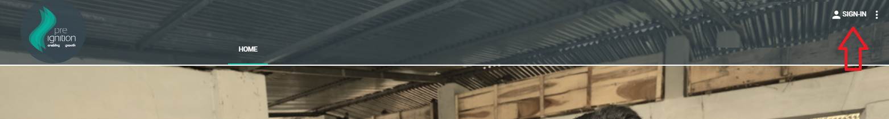
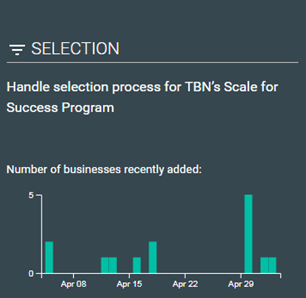
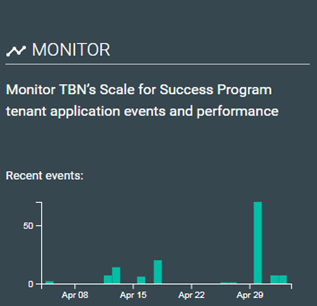
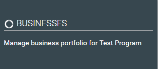
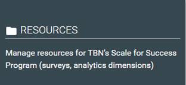
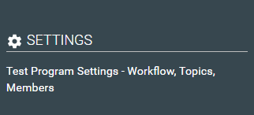

# Program

## Step 1- Logging on

* Go to [www.preignition.org](https://preignition.org/main/home) and sign in using your email and password

* 'Program’ and ‘Admin’ appear as additional options on the main menu bar
* Select ‘Program’

## Step 2- Overview of the Program page

* Five main options appear 

## Step 3- Selection

* This feature enables an user to manage the selection process for a particular program
* The graph shows the number of businesses that have applied to the program in the last month


Refer to the [Selection](https://program-user-docs.preignition.org/~/edit/drafts/-LFMZVONed2CdhnKStAa/users-program-and-advanced/portfolio/selection) page for more details


## Step 4- Monitor

* This section enables a user to monitor recent activity on the program and monitor the performance of the app


Refer to the [Monitor](https://program-user-docs.preignition.org/~/edit/drafts/-LFMZVONed2CdhnKStAa/users-program-and-advanced/portfolio/monitor) page for more details. This feature is under development


## Step 5- Businesses

* This section allows users to report on the progress of an individual business, a cohort of businesses or the overall program.
* Users are also able to access detailed information on an individual business


Refer to the [Businesses](https://program-user-docs.preignition.org/~/edit/drafts/-LFMdC8NivIZ5vp84-LV/users-program-and-advanced/portfolio/businesses) page for more details. This feature is under development


## Step 6- Resources

* This section allows users to set up and manage key resources for a program such as surveys, work flows, notifications etc


Refer to the [Resources](https://program-user-docs.preignition.org/~/edit/primary/users-program-and-advanced/portfolio/resources) page for more details


## Step 7- Settings

* This section allows users to define and edit key settings for a program such as language, currency, user rights etc.


Refer to the [Settings](https://program-user-docs.preignition.org/~/edit/primary/users-program-and-advanced/portfolio/settings) page for more details


