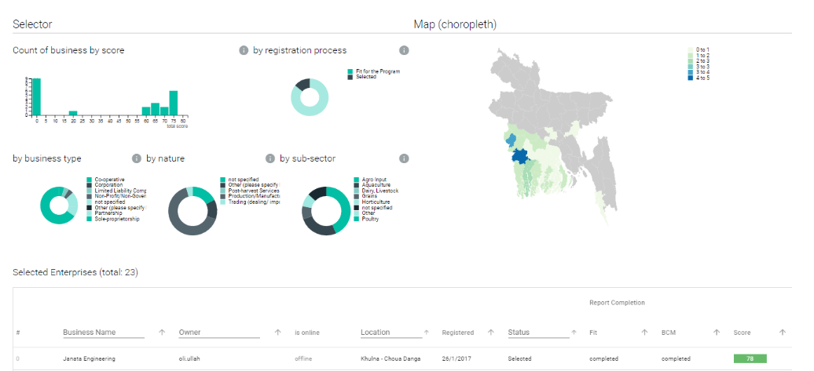

# Businesses


The businesses page is currently under development and is not accessible from [www.preignition.org](https://preignition.org/main/home).    This page describes the features which will be available in the future.


The Businesses page is where a user can report on the performance of their program.

A wide variety of reports can be run using data which has been collected from businesses and is available on the platform.

Examples of reports include:

* Portfolio reports showing the key characteristics of a group of businesses at a point in time

* Impact reports showing the progress a business or group of businesses has made over time
* Bench marking reports showing how a business or group of businesses compares to a wider group.

