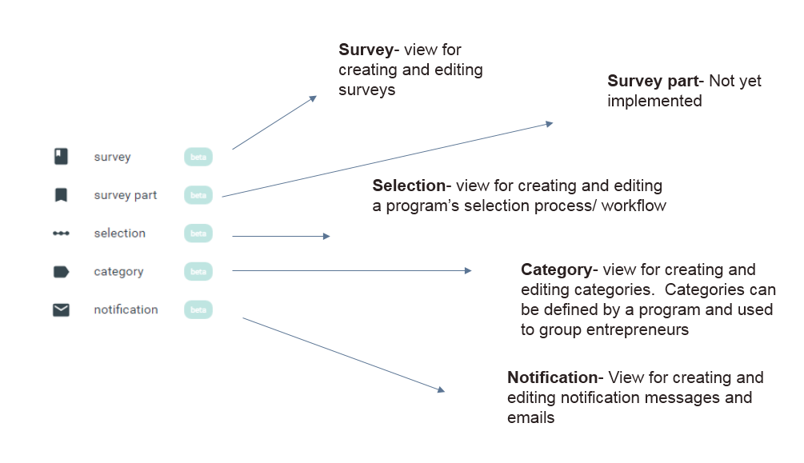

# Resources

## Step 1- Accessing the resources page

* The resources page is accessed via the [program](https://program-user-docs.preignition.org/~/edit/drafts/-LFMmRn-kR0r-yY1WvIl/users-program-and-advanced/portfolio) page
* The name of the active program is clearly indicated

## Step 2- Overview of the resources page

* Clicking on the ‘resources’ icon takes you though to the following screen

## Step 3- Resources explained

## Step 4- Detailed guidance notes for resources

Detailed guidance notes are available for each type of resource.

* [Surveys](https://program-user-docs.preignition.org/~/edit/drafts/-LFMn01-C-D_7xApAmsF/users-program-and-advanced/portfolio/resources/surveys)
* [Survey Part](https://program-user-docs.preignition.org/~/edit/drafts/-LFMn01-C-D_7xApAmsF/users-program-and-advanced/portfolio/resources/survey-part)
* [Selection process](https://program-user-docs.preignition.org/~/edit/drafts/-LFMn01-C-D_7xApAmsF/users-program-and-advanced/portfolio/resources/selection-process)
* [Categories](https://program-user-docs.preignition.org/~/edit/drafts/-LFMn01-C-D_7xApAmsF/users-program-and-advanced/portfolio/resources/categories)
* [Notifications](https://program-user-docs.preignition.org/~/edit/drafts/-LFMn01-C-D_7xApAmsF/users-program-and-advanced/portfolio/resources/notifications)

