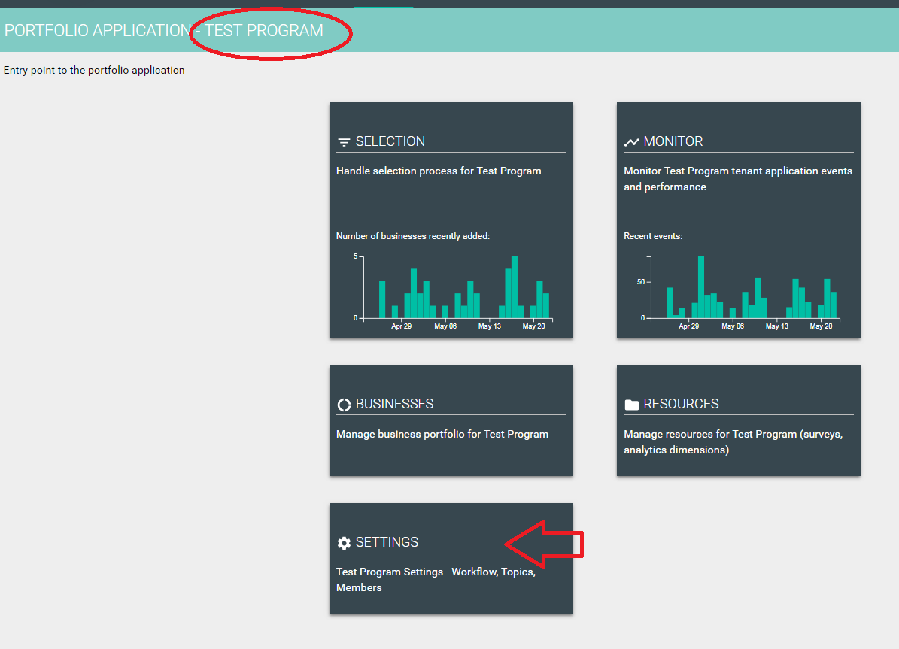

# Settings

## Step 1- Accessing the settings page

* The settings page is accessed via the [program page](https://program-user-docs.preignition.org/~/edit/drafts/-LFXa08d6g2yPgWJJMdg/users-program-and-advanced/portfolio)
* The name of the active program is clearly indicated

## Step 2- Overview of the settings page

* Clicking on the ‘settings’ icon takes you though to the following screen

## Step 3- Settings explained

## Step 4- Detailed guidance notes for settings

Detailed guidance notes are available for each type of setting.

* [Program settings](https://program-user-docs.preignition.org/~/edit/drafts/-LFXfGruRiTmg7XcHoMG/users-program-and-advanced/portfolio/settings/profile)
* [Presentation](https://program-user-docs.preignition.org/~/edit/drafts/-LFXa08d6g2yPgWJJMdg/users-program-and-advanced/portfolio/settings/presentation)
* [My profile](https://program-user-docs.preignition.org/~/edit/drafts/-LFXa08d6g2yPgWJJMdg/users-program-and-advanced/portfolio/settings/my-profile)
* [Members](https://program-user-docs.preignition.org/~/edit/drafts/-LFXa08d6g2yPgWJJMdg/users-program-and-advanced/portfolio/settings/members)
* Labels- Not yet implemented
* [Communication](https://program-user-docs.preignition.org/~/edit/drafts/-LFXa08d6g2yPgWJJMdg/users-program-and-advanced/portfolio/settings/communication)
* [Batches](https://program-user-docs.preignition.org/~/edit/drafts/-LFXa08d6g2yPgWJJMdg/users-program-and-advanced/portfolio/settings/batches)

